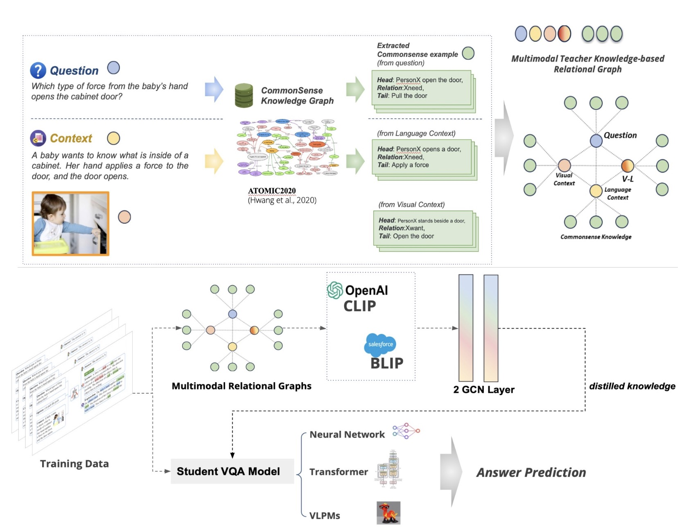

# Multimodal Commonsense Knowledge Distillation for Visual Question Answering

<div align="center">
      <h2>Authors</h2>
      <p>
        <strong>Shuo Yang</strong><sup>1</sup>,  
        <strong>Siwen Luo</strong><sup>2</sup>
        <strong>Soyeon Caren Han</strong><sup>1,*</sup>,  

        <br>
      </p>
</div>

<div align="center">
    <p>
        <sup>1</sup> The University of Melbourne
        <sup>2</sup> The University of Western Australia
    </p>
</div>

<div align="center">
<p>
      <a href="mailto:shuo.yang.3@unimelb.edu.au">shuo.yang.3@unimelb.edu.au</a> 
      <a href="mailto:caren.han@unimelb.edu.au">caren.han@unimelb.edu.au</a>,  
</p>
</div>

<div align="center">

<strong style="font-size: 18px;">Accepted by the 2025 Proceedings of the AAAI Conference on Artificial Intelligence</strong> <br>
    <strong style="font-size: 18px;">(AAAI 2025) - Best Poster Award</strong>
</div>

Implementation of [Multimodal Commonsense Knowledge Distillation for Visual Question Answering]([https://aclanthology.org/2025.findings-acl.872/](https://ojs.aaai.org/index.php/AAAI/article/view/35320)). 

<p align="center"></p>

## Updates
- [08/24/2025]:🎉 Will be open-sourced very soon

## Abstract
Existing Multimodal Large Language Models (MLLMs) and Visual Language Pretrained Models (VLPMs) have shown remarkable performances in general Visual Question Answering (VQA). However, these models struggle with VQA questions that require external commonsense knowledge due to the challenges in generating high-quality prompts and the high computational costs of fine-tuning. In this work, we propose a novel graph-based multimodal commonsense knowledge distillation framework that constructs a unified relational graph over commonsense knowledge, visual objects and questions through a Graph Convolutional Network (GCN) following a teacher-student environment. This proposed framework is flexible with any type of teacher and student models without further fine-tuning, and has achieved competitive performances on the ScienceQA dataset.


## How to Use Multimodal Commonsense Knowledge Distillation for Visual Question Answering
TBD


------


If you find our method useful, please kindly cite our paper.
```bibtex
@article{Yang_Luo_Han_2025,
  title={Multimodal Commonsense Knowledge Distillation for Visual Question Answering},
  author={Yang, Shuo and Luo, Siwen and Han, Soyeon Caren},
  volume={39},
  url={https://ojs.aaai.org/index.php/AAAI/article/view/35320},
  DOI={10.1609/aaai.v39i28.35320}, 
  number={28},
  journal={Proceedings of the AAAI Conference on Artificial Intelligence},
  year={2025},
  month={Apr.},
  pages={29545-29547}
}
```

## 4. Contributing
We welcome contributions from the research community to improve the efficiency of our model. If you have any ideas or would like to report a bug, please open an issue or submit a pull request.

## 5. License
The code is released under the MIT License.

